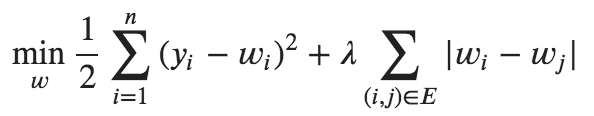
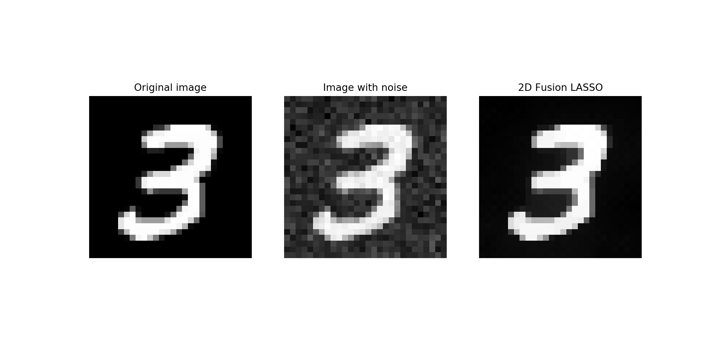

## 2D Fused LASSO for grayscale image restoration

### Problem

Fused LASSO is a variation of MSE + L1 regularization. We penalize weight (which corresponds to pixel brightness value) for being different from nearby pixels. As widely known, L1 is not differentiable, but it is convex, thus subgradient can be calculated, which corresponds to sign(w). Apart from this, training process is not that much different from regular Gradient Descent. To be fancy, three optimization algorithms implemented: vanilla Gradient Descent, GD with Momentum, and Nesterov-corrected momentum (NAG).

### Examples

Gaussian noise N(0, 20) is added to each of the examples, then model is trained and result is compared with both the original and noisy image. Metric used for evaluation is a modification R^2 coefficient, where Variance is replaced with estimation of Gaussian noise standard deviation. This can be interpreted as amount of variation of the original image "preserved" in denoised version.

R^2 = 0.89

### Interface

Along with a research notebook, `fused_lasso.py` file contains model object with sklearn-like interface.

## Acknowledgements

- Ryan Tibshirani's [course](https://www.stat.cmu.edu/~ryantibs/convexopt/) on convex optimization
- Sebastian Ruder's  [blog post](http://ruder.io/optimizing-gradient-descent/) on Gradient Descent optimization algorithms
- Yann LeCun's [MNIST dataset](http://yann.lecun.com/exdb/mnist/)
